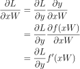
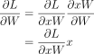
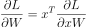
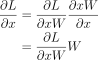
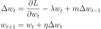

# CSE 576 Homework 3


Welcome friends,

It's time for neural networks!

 - It should work the same way as previous HW. Download, compile, test.
 - This time we are testing by training on various image recognition datasets (MNIST/CIFAR)
 - The repo is tested to work with Linux and MacOS.
 
 
## Getting Started

First, clone the repository!

    git clone https://github.com/holynski/cse576_sp20_hw3.git
    
Download the necessary datasets. Once you run the commands they should be present in the directories `mnist` and `cifar`.

    ./download_datasets.sh
    
You can now compile your code with cmake.

    mkdir build
    cd build
    cmake ..
    make
    
Or you can use the convenience script to provide

    ./compile.sh

This will build the code and create an executable on the project directory called `train`. You can run it as:

    ./train

## Codebase Summary

We've added a bunch of new data structures and types to use for building up neural networks and other machine learning algorithms. 
Please read through these source files before starting the assignment--it may save you a lot of time.

### Data Structures
#### `matrix.h`
The core of this assignment will be the `Matrix` class. You should read through `src/matrix.h` and get a feel for what is there.
Here are some pointers to get you started:

 - The basic arithmetic operators are overloaded so if you have two matrices `A` and `B` you can call `A-B`, `A+B`, `A/B`.
 - The `*` operator represents matrix multiplication so `A*B` will matrix-multiply `A` and `B`.
 - If you want to do elementwise multiplication you can call `Matrix::elementwise_multiply(A, B)`
 - We also provide other functions such as `transpose()` so please make use if them.
 
#### `neural.h`

This file contains definitions for constructing a neural network.

 - `Layer`: this class will contain the definition as well as the weights and gradient updates of a neural network layer.
 - `Activation`: this is an `enum` which defines different types of activation functions.
 
### What you'll be implementing

We will be training a fully-connected neural network for this assignment. 

 - `src/activation.cpp`: you will implement the forward and backward passes for several activation functions.
 - `src/classifier.cpp`: you will implement gradient computation and parameter updates using algorithms we discussed in class.
 
You'll be training on two datasets, one is MNIST which is a digit-recognition dataset. The other is a simple visual recognition dataset 
called CIFAR.

## 1. Implementing Neural Networks ##


## 1.1 Activation Functions ##

An important part of machine learning, be it linear classifiers or neural networks, is the activation function you use. 

We will be implementing the following activation functions:

 - Linear: `f(x) = x`
 - Logistic: `f(x) = 1 / (1 + exp(-x))`
 - tanh: `f(x) = tanh(x)`
 - ReLU: `f(x) = max(0, x)`
 - Leaky ReLU: `f(x) = 0.01*x if x < 0 else x`
 - Softmax: https://en.wikipedia.org/wiki/Softmax_function

### 1.1.1 Activation Forward Pass

Fill in the `Matrix forward_*(const Matrix& matrix)` functions in `src/activations.cpp`. 

 - The input is a non-activated layer output `matrix` and the output `f(matrix)` is the activation applied elementwise (so you may need to write `for` loops over all pixels).
 - Remember that for our softmax activation we will take `e^x` for every element `x`, but then we have to normalize each element by the sum as well. Each row in the matrix is a separate data point so we want to normalize over each data point separately.

### 1.1.2 Activation Backward Pass

We will now compute the backwards pass for each activation. Each function signature looks like

    Matrix backward_*(const Matrix& out, const Matrix& prev_grad)
    
where `out` is the **activated** layer output and `prev_grad` is the gradient of the next layer (towards the loss function).

To compute the backward pass: 
 1. First compute gradient of the activation function `f'(x)` i.e. the partial derivative of the activated layer output with respect to the non-activated layer output.
 2. Then multiply the gradient contribution of the activation by the gradient from the next layer and return it.
 
Note that we compute the gradient only based on the activated output:
 - Normally, to calculate `f'(x)` we would need to remember what the input to the function, `x`, was. 
 - However, all of our activation functions have the nice property that we can calculate the gradient `f'(x)` only with the output `f(x)`. This means we have to remember less stuff when running our model.

To get you started, we'll provide you with the derivative of the logistic function. You can read more about it [here](https://en.wikipedia.org/wiki/Logistic_function#Derivative).

    # Derivative of the logistic (sigmoid) function.
    f'(x) = f(x) * (1 - f(x))

Compute the symbolic derivatives of each of the activation functions (feel free to look to the slides if necessary).
 - For Leaky ReLU, use a slope of 0.01.
 - As discussed in the backpropagation slides, we just multiply our partial derivative by `f'(x)` to backpropagate through an activation function. 
 
Notes on Softmax:
 - The gradient computation for Softmax is a bit trickier than the other ones since it's a vector-to-vector function.
 - We've provided some skeleton code to get you started. You must first compute the Jacobian of the Softmax function in `softmax_jacobian`.
 - Use the Jacobian in `backward_softmax` to then compute the actual backward pass.
 - Here are some excellent notes: https://mattpetersen.github.io/softmax-with-cross-entropy

Fill in the `Matrix backward_*(const Matrix& out, const Matrix& prev_grad)` functions in `src/activations.cpp` to multiply the elements of `prev_grad` by the correct gradient where `out` is the output of a layer. 

## 1.3 Layer Forward Propagation ##

Now we can fill in how to forward-propagate information through a layer. First check out our layer struct:

    struct Layer
      {
      // Runtime Data terms
      Matrix in;              // Input to a layer (aka x)
      Matrix out1;            // Output before activation (aka xw)
      Matrix out2;            // Output after activation (actual output, aka y)

      // Backpass saved terms
      Matrix grad_out1;
      Matrix grad_in;  

      // Weight and weight management
      Matrix w;               // Current weights for a layer
      Matrix grad_w;          // Current weight updates
      Matrix v;               // Past weight updates (for use with momentum)

      // Type
      Activation activation;  // Activation the layer uses
      ......
    }

During forward propagation we will do a few things. 
 - We'll multiply the input matrix by our weight matrix `w`. 
 - We'll apply the activation function `activation`. 
 - We'll also save the input and output matrices in the layer so that we can use them during backpropagation. But this is already done for you.

Fill in the TODOs in `src/classifier.cpp`:
 - `Matrix forward_weights(const Layer &l, const Matrix &in)` 
    * Hint: Each row in the input `in` is a separate data point and each row in the returned matrix is the result of passing that data point through the layer.
    * Using matrix operations we can batch-process data. 
    * Think about the shapes of the matrices what the multiplication order should be.
 - `Matrix forward_activation(const Layer &l, const Matrix &out1)`. 
    * Hint: make use of the function `Matrix forward_activate_matrix(const Matrix &matrix, Activation a)`
 
See `Matrix Layer::forward(const Matrix& in)` to see how they are connected.

## 1.4 Layer Backward Propagation ##

We have to backpropagate error through our layer. 

 - We will be given `dL/dy`, the derivative of the loss with respect to the output of the layer, `y`. 
 - The output `y` is given by `y = f(xw)` where `x` is the input, `w` is our weights for that layer, and `f` is the activation function. 
 - What we want to calculate is `dL/dw` so we can update our weights and `dL/dx` which is the backpropagated loss to the previous layer. 
 
Look at `Matrix Layer::backward(const Matrix& grad_y)` to see how they are connected.

### 1.4.1 Gradient of activation function ###

First we need to calculate `dL/d(xw)` using the gradient of our activation function. Recall:



Use the `Matrix backward_activate_matrix(const Matrix& out, const Matrix& prev_grad, Activation a)` function to compute derivative `dL/d(xw)` from `dL/dy`.

Fill in `Matrix backward_xw(const Layer &l, const Matrix &grad_y)` in `src/classifier.cpp`.

### 1.4.2 Derivative of loss w.r.t. weights ###

Next we want to calculate the derivative with respect to our weights, `dL/dw`. Recall:



But remember from the slides, to make the matrix dimensions work out right we acutally do the matrix operation 


     
where `x^T` is the transpose of the input matrix `x`.

In our layer we saved the input as `l.in`. 
 1. Calculate `x^T` using that and the matrix transpose function in our library: `mat.transpose()`. 
 2. Then calculate `dL/dw` and save it into `l->dw`. We'll use this later when updating our weights.

Fill in the TODOs in `Matrix backward_w(const Layer &l)` in `src/classifier.cpp`.

### 1.4.3 Derivative of loss w.r.t. input ###

Next we want to calculate the derivative with respect to the input as well, `dL/dx`. Recall:



Again, we have to make the matrix dimensions line up so it actually ends up being `dL/d(xw) * wt` where `wt` is the transpose of our weights, `w`. 

Calculate `wt` and then calculate dL/dx. This is the matrix we will return.

Fill in the TODOs in `Matrix backward_x(const Layer &l)` in `src/classifier.cpp`.

## 1.5 Weight updates ##

After forward and backward propagation, we've computed the gradients of the loss w.r.t. the weights. We can use these gradients to perform gradient updates to the weights.

With learning rate (η), momentum (m) and weight decay (λ) our weight update rule is:



Some notes:
 - We'll be doing gradient ascent (the partial derivative component is positive) instead of descent because we'll flip the sign of our partial derivative when we calculate it at the output. 
 - We saved `dL/dw_t` as `l.grad_w` 
 - By convention we'll use `l.v` to store the previous weight change `Δw_{t-1}`.

Now let's compute implement the update rule:
 1. Calculate the current weight change as a weighted sum of `l.grad_w`, `l.w`, and `l.v`. Although these are vector quantities, our Matrix library treats them as a 1-dimensional matrix and you can use standard matrix-scalar products. 
 2. Save the current weight change in `l.v` for next round.
 3. Finally, apply the weight change to your weights by adding a scaled amount of the change based on the learning rate.

Fill in `void update_layer(Layer& l, double rate, double momentum, double decay)` using the update rule.


## 1.6 Read through the rest of the code ##

Check out the remainder of the functions which string layers together to make a model, run the model forward and backward, update it, train it, etc. Notable highlights:

#### `Layer::Layer(int input, int output, Activation activation)` ####

Makes a new layer that takes `input` number of inputs and produces `output` number of outputs. Note that we randomly initialize the weight vector, in this case with a uniform random distribution between `[-sqrt(2/input), sqrt(2/input)]`. The weights could be initialize with other random distributions but this one works pretty well. This is one of those secret tricks you just have to know from experience!

#### `double Model::accuracy(const Data& d)` ####

Will be useful to test out our model once we are done training it.


#### `double cross_entropy_loss(const Matrix& y, const Matrix& p)` ####

Calculates the cross-entropy loss for the ground-truth labels `y` and our predictions `p`. For classification of an image into one of say `N` object classes, `y` is an `N`-length vector with all zero values except for the object class present in the image, for which it is 1. Cross-entropy loss is negative log-likelihood (log-likelihood is for logistic regression) for multi-class classification. Since we added the negative sign it becomes a loss function that we want to minimize. Cross-entropy loss is given by:

    L = Σ(-y_i log(p_i))

for a single data point, summing across the different classes. If the output of our final layer uses a softmax: `y = σ(wx)` then:

    dL/d(wx) = -Σ(y_i / p_i)

#### `void Model::train(...)` ####

Our training code to implement SGD. First we get a random subset of the data using `Data Data::random_batch(int batch_size)`. Then we run our model forward and calculate the error we make `dL/dy`. Finally we backpropagate the error through the model and update the weights at every layer.

## 2. Training on MNIST ##

We'll be testing out your implementation on the [MNIST dataset](http://yann.lecun.com/exdb/mnist/)!

### 2.1 Getting the data ###

Run `download_datasets.sh` to download the MNIST and CIFAR datasets. If not running on Linux read the file to see where the datasets would have to go and download manually.

### 2.2 Train a linear softmax model ###

Check out `train.cpp` to see how we're actually going to run the machine learning code you wrote. 

There are a couple example models in here for softmax regression and neural networks. 

Run the program `train` to train a softmax regression model on MNIST. You will see a bunch of numbers scrolling by, this is the loss calculated by the model for the current batch. Hopefully over time this loss goes down as the model improves.

After training, the program will calculate the accuracy the model gets on both the training dataset and a separate testing dataset. You should get over 90% accuracy.

Answer questions 2.2.1-2.2.3 in [`questions.txt`](questions.txt).

### 2.3 Train a neural network

Now change the training code to use the neural network model instead of the softmax model.

Answer questions 2.3.1-2.3.6 in [`questions.txt`](questions.txt).

#### Notes on Question 2.3.6

While the derivative of L2 loss is straightforward, the gradient of L1 loss is constant and will affect the training (either the accuracy will be low or the model will converge to a large loss within a few iterations.) 

To avoid this, compute the [Huber loss](https://en.wikipedia.org/wiki/Huber_loss) instead of L1 and write Huber loss equation in `l1_loss()`. In simple words, Huber loss is equal to L1 loss when `y - p` is > 1 and equal to L2 loss when <= 1. You may have to be careful about the sign (i.e. `y-p` or `p-y`).


## 3. Training on CIFAR ##

The [CIFAR-10](https://www.cs.toronto.edu/~kriz/cifar.html) dataset is meant to be similar to MNIST but much more challenging. Using the same model we just created, let's try training on CIFAR.

### 3.1 Get the data

If you haven't already, run `download_datasets.sh` to download the CIFAR dataset.


### 3.2 Train on CIFAR ###

Modify `train.cpp` to use CIFAR. This should mostly involve swapping out references to `mnist` with `cifar` during dataset loading. Then try training the network. You may have to fiddle with the learning rate to get it to train well.

Answer questions 3.2.1 in [`questions.txt`](questions.txt).

## 4. Turn it in ##

Turn in your `activations.cpp`, `classifier.cpp`, and `questions.txt` on canvas under Assignment 3.

## Hints and Tips

 - Make sure to test early and often. Make good use of prints.
 - If you get NaNs, suspect you have a divide by zero somewhere.
 - [gdb](https://www.cs.cmu.edu/~gilpin/tutorial/) is a great tool for debugging especially when your code is crashing.
 - If you find that debugging is too slow, it's probably because of the data loading code. 
 You can modify the data loading function in `src/train.cpp` to load the test set as the training set 
 (since the test set is much smaller). Just remember to switch it back after debugging!
 - We provide you with some tools in the `Matrix` class for easy debugging. You can use `Matrix::print(int maxrows, int maxcols)` to print out matrices for debugging.
 - We also provide a handy `debug_print` function in `classifier.cpp` which will only print if you call`set_verbose(true)` first.
 
## Grading rubric

```
forward_linear       1
forward_logistic     2
forward_tanh         2
forward_relu         1
forward_lrelu        1
forward_softmax      3
backward_linear      1
backward_logistic    2
backward_tanh        3
backward_relu        2
backward_lrelu       2
backward_softmax     3
softmax_jacobian     3
forward_weights      4
forward_activation   4
backward_xw          5
backward_w           6
backward_x           6
update_layer         9
Q2.2.1               4
Q2.2.2               4
Q2.2.3               4
Q2.3.1               4
Q2.3.2               4
Q2.3.3               4
Q2.3.4               4
Q2.3.5               4
Q2.3.6               4
Q3.2.1               4

Total 100
```
 
